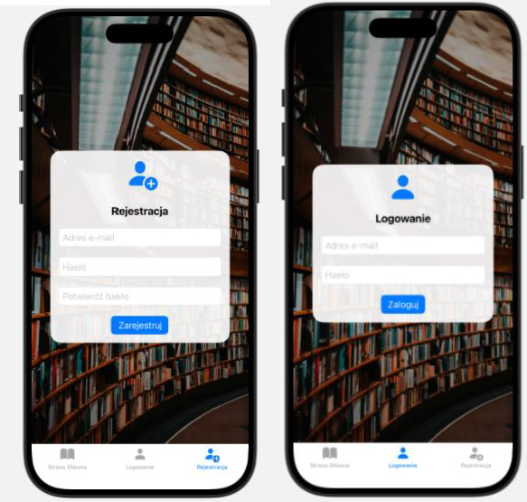
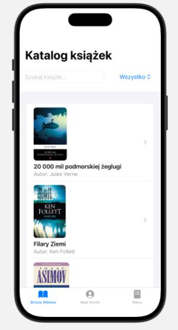
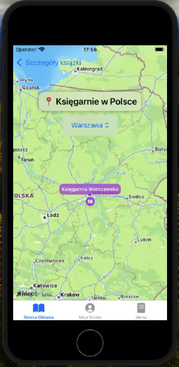
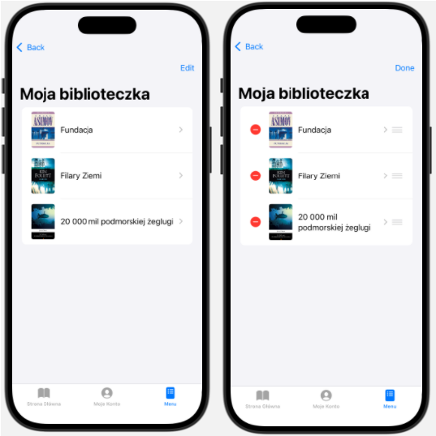

# Biblioteczka – Aplikacja do zarządzania książkami (iOS)

Aplikacja mobilna stworzona na platformę iOS. Pozwala użytkownikom na wygodne zarządzanie osobistą kolekcją książek, wyszukiwanie nowych tytułów oraz lokalizowanie księgarni.

---

## 📸 Screeny z aplikacji

  
  
  
  
  

---

## Główne funkcjonalności

* **System kont**: Rejestracja i logowanie za pomocą e-maila i hasła.
* **Zarządzanie kontem**: Możliwość edycji adresu e-mail oraz zmiany hasła bezpośrednio w profilu użytkownika.
* **Wyszukiwarka**: Filtrowanie książek po tytule, autorze lub kategorii.
* **Szczegóły książki**: Podgląd opisu, ceny, numeru ISBN, wydawnictwa oraz szacowanego czasu czytania.
* **Zarządzanie listą "Zapisanych"**:
    * Dodawanie i usuwanie książek z kolekcji.
    * Zmiana kolejności pozycji na liście (Drag-and-Drop).
    * Powiększanie okładki w pełnej rozdzielczości (Long Press).
* **Integracja z Mapami**: Sprawdzanie dostępności książek w fizycznych księgarniach w różnych miastach Polski.

---

## Technologie
* **Swift / SwiftUI** – Interfejs i logika aplikacji.
* **Core Data** – Przechowywanie danych lokalnych (książki, użytkownicy).
* **MapKit** – Obsługa map i lokalizacji księgarni.

---

## ⚙️ Jak uruchomić projekt?
1. Sklonuj repozytorium: `git clone https://github.com/Neskka/Biblioteczka.git`
2. Otwórz plik `.xcodeproj` w programie **Xcode**.
3. Wybierz symulator (np. iPhone 15 lub nowszy).
4. Kliknij przycisk **Run** (Cmd + R).